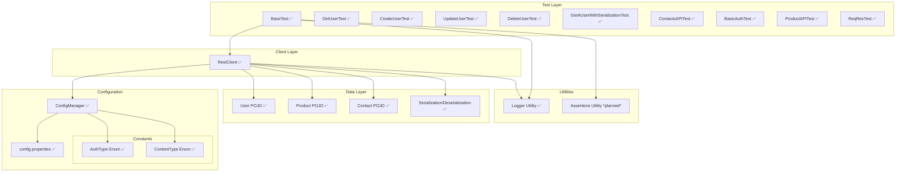

# API Test Automation Framework (WIP)
⚠️ **Status**: This framework is still under development. Features and documentation may change.
---
## Overview
This framework is designed to test RESTful APIs with a modular layered architecture.  
<!-- Current layers: **Test Layer**, **Client Layer**, **Configuration & Constants**, **Data Layer**, and **Utilities**. -->
- **Current layers:** Test Layer, Client Layer, Configuration & Constants, Data Layer, and Utilities.
---
## Architecture
### 1. Test Layer
- **BaseTest** (setup)  
- **GetUserTest**, **CreateUserTest**, **UpdateUserTest**  
- More tests *planned*: DeleteUserTest, Serialization tests, Contacts API, etc.
### 2. Client Layer
- **RestClient** for HTTP methods (`GET`, `POST`, `PUT`, `PATCH`, `DELETE`)  
- Handles auth, request/response specs, query/path params  
### 3. Configuration
- **ConfigManager** loads properties dynamically  
- **config.properties** stores tokens, credentials, base URLs  
- **AuthType Enum** ✅
- **ContentType Enum** ✅
### 4. Data Layer
- **User POJO**  
- *Planned*: Product POJO, Contact POJO, Serialization/Deserialization with Jackson
### 5. Utilities
- **Logger utility** ✅
- *Planned*: Assertions utility  
- *Planned*: Test data utilities  
- *Planned*: Serialization helpers  
---
### Future Possibilities (Exploratory)
These are not committed features, but areas we may explore later:
- Docker (containerized execution)  
- CI/CD integration (Jenkins/GitHub Actions)  
- Mockito (mocking for isolated tests)  
- AWS hosting  
- Kubernetes for scaling test runs  
 
---
## Flow Summary
1. `ConfigManager` loads configuration (keys, tokens, base URLs).  
2. `BaseTest` initializes the `RestClient`.  
3. `RestClient` executes HTTP requests.  
4. Responses map into POJOs.  
5. Tests run assertions (utilities planned).  
6. `Logger` records test execution details, errors, and API responses.
---
## Tech Stack
- Java 17  
- RestAssured  
- Jackson  
- TestNG / JUnit  
- Maven / Gradle  
- Log4j / SLF4J
---
## Logging Features
- **Test execution logging**: Records start/end of test execution
- **Request/Response logging**: Captures API request details and response bodies
- **Error logging**: Detailed error capture with stack traces
- **Configuration**: Configurable log levels (DEBUG, INFO, ERROR)
- **Output formats**: Console and file output with rolling file policy
---
## Visual Diagram (WIP + Planned)

   
## Roadmap
- [x] Implement Logger utility
- [x] Add DeleteUserTest
- [x] Add serialization/deserialization tests
- [x] Implement Product & Contact POJOs
- [ ] Build Assertion utilities 
***Current status:**** Modules marked "✅" are implemented. Others are pending implementation.*
