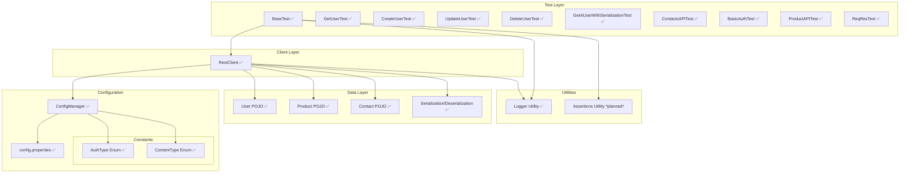

# API Test Automation Framework (WIP)
⚠️ **Status**: This framework is still under development. Features and documentation may change.
---
## Overview
This framework is designed to test RESTful APIs with a modular layered architecture.  
<!-- Current layers: **Test Layer**, **Client Layer**, **Configuration & Constants**, **Data Layer**, and **Utilities**. -->
- **Current layers:** Test Layer, Client Layer, Configuration & Constants, Data Layer, and Utilities.
---
## Architecture
### 1. Test Layer
- **BaseTest** (setup)  
- **GetUserTest**, **CreateUserTest**, **UpdateUserTest**  
- More tests *planned*: DeleteUserTest, Serialization tests, Contacts API, etc.
### 2. Client Layer
- **RestClient** for HTTP methods (`GET`, `POST`, `PUT`, `PATCH`, `DELETE`)  
- Handles auth, request/response specs, query/path params  
### 3. Configuration
- **ConfigManager** loads properties dynamically  
- **config.properties** stores tokens, credentials, base URLs  
- **AuthType Enum** ✅
- **ContentType Enum** ✅
### 4. Data Layer
- **User POJO**  
- *Planned*: Product POJO, Contact POJO, Serialization/Deserialization with Jackson
### 5. Utilities
- **Logger utility** ✅
- *Planned*: Assertions utility  
- *Planned*: Test data utilities  
- *Planned*: Serialization helpers  
---
### Future Possibilities (Exploratory)
These are not committed features, but areas we may explore later:
- Docker (containerized execution)  
- CI/CD integration (Jenkins/GitHub Actions)  
- Mockito (mocking for isolated tests)  
- AWS hosting  
- Kubernetes for scaling test runs  
 
---
## Flow Summary
1. `ConfigManager` loads configuration (keys, tokens, base URLs).  
2. `BaseTest` initializes the `RestClient`.  
3. `RestClient` executes HTTP requests.  
4. Responses map into POJOs.  
5. Tests run assertions (utilities planned).  
6. `Logger` records test execution details, errors, and API responses.
---
## Tech Stack
- Java 17  
- RestAssured  
- Jackson  
- TestNG / JUnit  
- Maven / Gradle  
- Log4j / SLF4J
---
## Logging Features
- **Test execution logging**: Records start/end of test execution
- **Request/Response logging**: Captures API request details and response bodies
- **Error logging**: Detailed error capture with stack traces
- **Configuration**: Configurable log levels (DEBUG, INFO, ERROR)
- **Output formats**: Console and file output with rolling file policy
---
## Visual Diagram (WIP + Planned)

   
## Roadmap
- [x] Implement Logger utility
- [x] Add DeleteUserTest
- [x] Add serialization/deserialization tests
- [x] Implement Product & Contact POJOs
- [ ] Build Assertion utilities 
***Current status:**** Modules marked "✅" are implemented. Others are pending implementation.*

## Custom Test Report HTML added | Instead of 'Allure' Logo Showing "CAPCO" logo in the report with Confetti Style Animation


[](https://www.linkedin.com/feed/update/urn:li:share:7365859054805524482)

## Added sonar coverage in local run
Test Coverage Pipeline: Test execution → Coverage data generation → XML report creation → SonarQube analysis

# Scanner reads configuration
TestNG → JaCoCo → Maven Surefire → SonarQube Scanner → SonarQube Server → Dashboard

## Added sonar coverage in local run
Test Coverage Pipeline: Test execution → Coverage data generation → XML report creation → SonarQube analysis
# Scanner reads configuration
TestNG → JaCoCo → Maven Surefire → SonarQube Scanner → SonarQube Server → Dashboard
```
Step 1: TestNG Test Execution
TestNG Framework
├── Reads: testng_regression.xml
├── Discovers: @Test annotated methods
├── Executes: API test cases (AmadeusAPITest.getOAuth2Token)
├── Handles: Test retries, parallel execution
└── Generates: Test results in memory

Step 2: JaCoCo Code Coverage Agent
JaCoCo Agent (prepare-agent goal)
├── Instruments: Java bytecode during test execution
├── Tracks: Which lines/branches executed
├── Records: Coverage data in binary format
└── Outputs: target/jacoco.exec file

Step 3: Maven Surefire Plugin
Surefire Plugin
├── Orchestrates: TestNG test execution
├── Captures: Test results (pass/fail/skip)
├── Generates: XML reports per test class
└── Outputs: target/surefire-reports/*.xml files

Step 5: SonarQube Scanner Analysis
SonarQube Scanner
├── Reads: sonar-project.properties configuration
├── Processes: Source code and test reports
├── Analyzes: Coverage XML (jacoco.xml)
└── Sends: Analysis data to SonarQube server

Step 6: SonarQube Server Processing
SonarQube Server
├── Receives: Analysis data from scanner
├── Stores: Metrics in database
├── Processes: Quality gate evaluation
├── Generates: Historical trend data
└── Updates: Web dashboard with results

Step 7: Dashboard Visualization
SonarQube Dashboard
├── Displays: Test coverage (43.1%)
├── Shows: Unit test count (20 tests)
├── Lists: Code quality issues (3 bugs, 42 code smells)
├── Presents: Security analysis (4 hotspots)
└── Provides: Actionable remediation guidance
```

## Data Flow Diagram


## Command Sequence

### Phase 1: Test Execution with Coverage

# Step 1: Run tests with JaCoCo instrumentation
mvn clean test -DsuiteXmlFile=src/test/resources/testrunners/testng_regression.xml

# Step 2: Generate JaCoCo XML report
mvn jacoco:report

# Step 3: Run SonarQube analysis
docker run --rm --network host -v "$(pwd):/usr/src" sonarsource/sonar-scanner-cli

```
File Dependencies
Configuration Files:
├── pom.xml (Maven + JaCoCo + Surefire plugins)
├── testng_regression.xml (Test suite definition)
└── sonar-project.properties (SonarQube configuration)

Generated Reports:
├── target/jacoco.exec (Binary coverage data)
├── target/site/jacoco/jacoco.xml (Coverage XML)
├── target/surefire-reports/*.xml (Test results)
└── SonarQube Dashboard (Final visualization)
```

## Key Integration Points
JaCoCo ↔ TestNG:

# JaCoCo agent instruments code before TestNG execution
Coverage tracking happens transparently during test runs

JaCoCo ↔ SonarQube:

# SonarQube reads JaCoCo XML reports for coverage metrics
Correlates coverage with static analysis findings

Surefire ↔ SonarQube:

# SonarQube imports test execution results
Shows test count, success rate, execution time

**Result:** Comprehensive test automation reporting with **43.1%** coverage visibility and quality metrics in your SonarQube dashboard.

```Local DashBoard Link: http://localhost:9000/dashboard?id=my-api-taf ```


### How Sonar Works | Confluence Page
https://learn-asingh.atlassian.net/wiki/x/AgDMAQ

