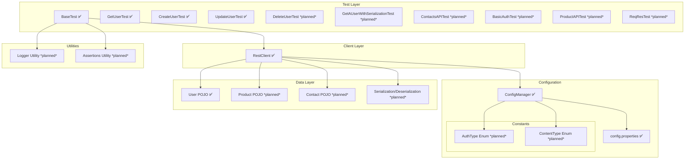

# API Test Automation Framework (WIP)

⚠️ **Status**: This framework is still under development. Features and documentation may change.

---

## Overview
This framework is designed to test RESTful APIs with a modular layered architecture.  
Current layers: **Test Layer**, **Client Layer**, **Configuration & Constants**, **Data Layer**, and **Utilities** (planned).

---

## Architecture

### 1. Test Layer
- **BaseTest** (setup)  
- **GetUserTest**, **CreateUserTest**, **UpdateUserTest**  
- More tests *planned*: DeleteUserTest, Serialization tests, Contacts API, etc.

### 2. Client Layer
- **RestClient** for HTTP methods (`GET`, `POST`, `PUT`, `PATCH`, `DELETE`)  
- Handles auth, request/response specs, query/path params  

### 3. Configuration
- **ConfigManager** loads properties dynamically  
- **config.properties** stores tokens, credentials, base URLs  
- *Planned*: `AuthType Enum`, `ContentType Enum`

### 4. Data Layer
- **User POJO**  
- *Planned*: Product POJO, Contact POJO, Serialization/Deserialization with Jackson

### 5. Utilities (Planned)
- Logger utility  
- Assertions utility  

---

## Flow Summary
1. `ConfigManager` loads configuration (keys, tokens, base URLs).  
2. `BaseTest` initializes the `RestClient`.  
3. `RestClient` executes HTTP requests.  
4. Responses map into POJOs.  
5. Tests run assertions (utilities planned).  

---

## Tech Stack
- Java 17  
- RestAssured  
- Jackson  
- TestNG / JUnit  
- Maven / Gradle  

---

## Visual Diagram (WIP + Planned)

   
## Roadmap
- [ ] Add DeleteUserTest  
- [ ] Add serialization/deserialization tests  
- [ ] Implement Product & Contact POJOs  
- [ ] Build Logger and Assertion utilities

_**Current status:** Modules marked "✅" are implemented. Others are pending implementation._
 
